# Pʟᴏᴛʟʏ++
[](https://github.com/jimmyorourke/plotlypp/actions/workflows/ci-macos-clang.yml) [](https://github.com/jimmyorourke/plotlypp/actions/workflows/ci-ubuntu-gcc.yml) [](https://github.com/jimmyorourke/plotlypp/actions/workflows/ci-ubuntu-clang.yml) [](https://github.com/jimmyorourke/plotlypp/actions/workflows/ci-windows-msvc.yml)

Plotly++ is a header-only C++ graphing library for creating interactive plots and charts, with rendering powered by [Plotly.js](https://plotly.com/javascript). Plots are generated as HTML, providing interactive visualizations that can be viewed in any modern web browser.

This makes Plotly++ extremely simple and lightweight for C++ applications; no graphics or rendering libraries or frameworks are required! Plotly++'s only additional dependency is a JSON library.

The more than 40 chart types supported by Plotly.js are supported by Plotly++.

Plotly++ is largely auto-generated from official Plotly.js sources.

## Examples

A comprehensive set of examples demonstrating various chart types can be found in the `examples/` directory and viewed online:

**[View Live Examples](https://jimmyorourke.github.io/plotlypp/)**

### Gallery

<table>
  <tr>
    <td align="center" width="20%" valign="top" style="padding: 10px;">
      <a href="https://jimmyorourke.github.io/plotlypp/examples/output/area_polar_chart.html">
        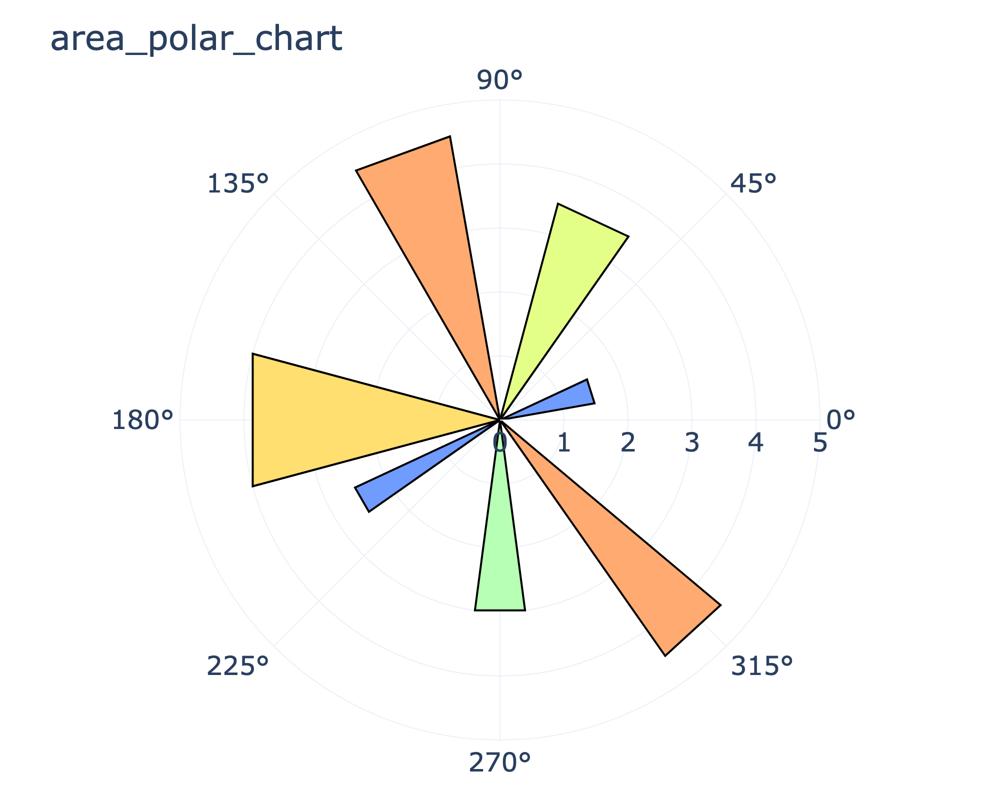
      </a>
      <br />
      <p style="margin-top: 8px;"><sub><b>area_polar_chart</b></sub></p>
    </td>
    <td align="center" width="20%" valign="top" style="padding: 10px;">
      <a href="https://jimmyorourke.github.io/plotlypp/examples/output/asymmetric_error_bars.html">
        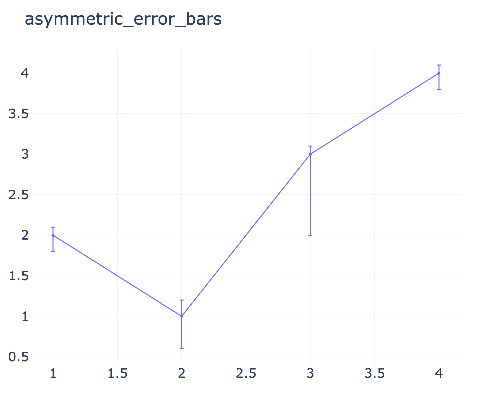
      </a>
      <br />
      <p style="margin-top: 8px;"><sub><b>asymmetric_error_bars</b></sub></p>
    </td>
    <td align="center" width="20%" valign="top" style="padding: 10px;">
      <a href="https://jimmyorourke.github.io/plotlypp/examples/output/basic_funnel.html">
        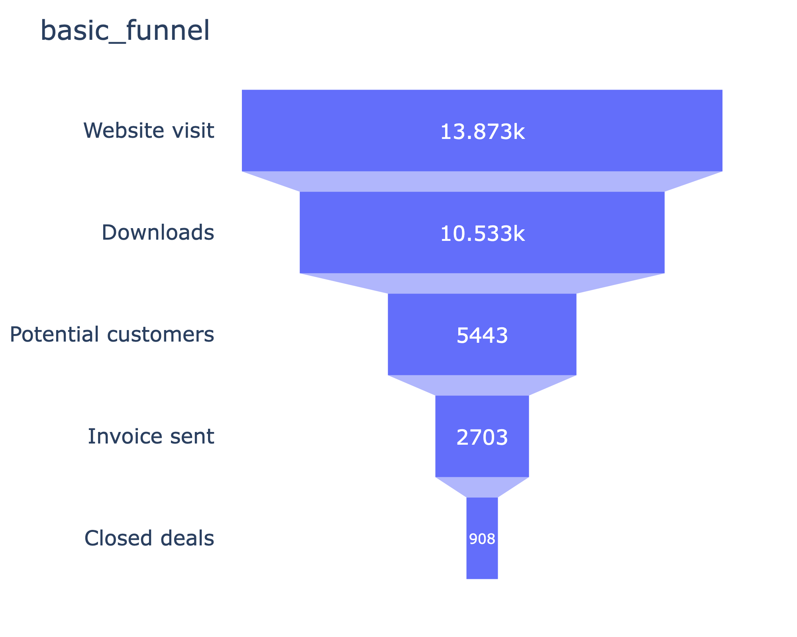
      </a>
      <br />
      <p style="margin-top: 8px;"><sub><b>basic_funnel</b></sub></p>
    </td>
    <td align="center" width="20%" valign="top" style="padding: 10px;">
      <a href="https://jimmyorourke.github.io/plotlypp/examples/output/basic_horizontal_violin_plot.html">
        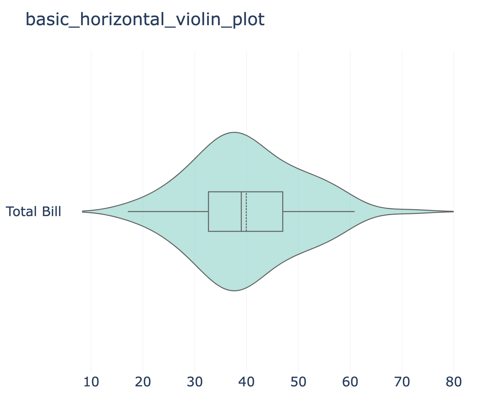
      </a>
      <br />
      <p style="margin-top: 8px;"><sub><b>basic_horizontal_violin_plot</b></sub></p>
    </td>
    <td align="center" width="20%" valign="top" style="padding: 10px;">
      <a href="https://jimmyorourke.github.io/plotlypp/examples/output/basic_overlaid_area.html">
        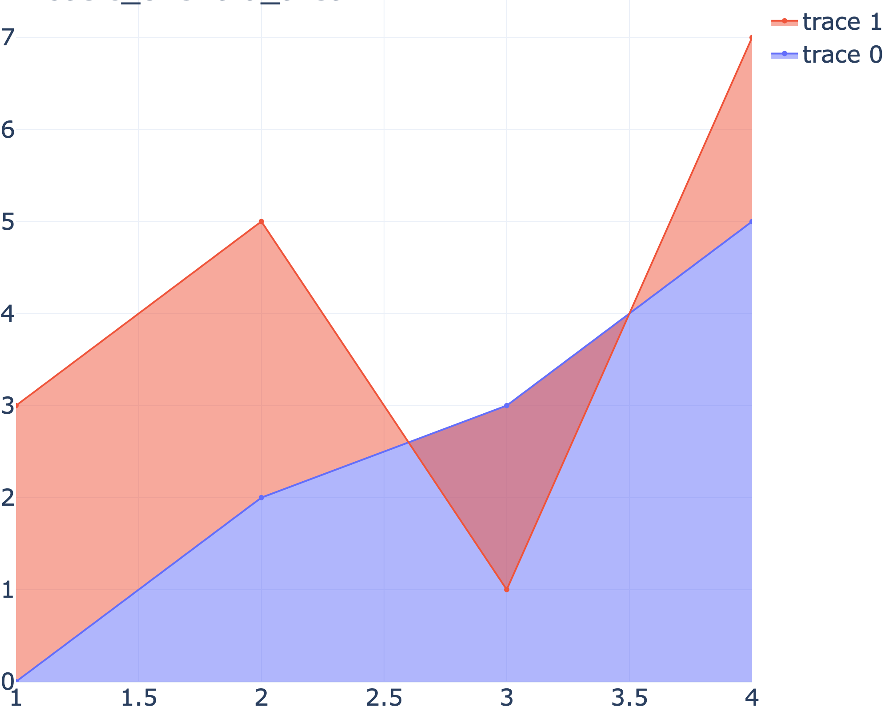
      </a>
      <br />
      <p style="margin-top: 8px;"><sub><b>basic_overlaid_area</b></sub></p>
    </td>
  </tr>
  <tr>
    <td align="center" width="20%" valign="top" style="padding: 10px;">
      <a href="https://jimmyorourke.github.io/plotlypp/examples/output/basic_pie.html">
        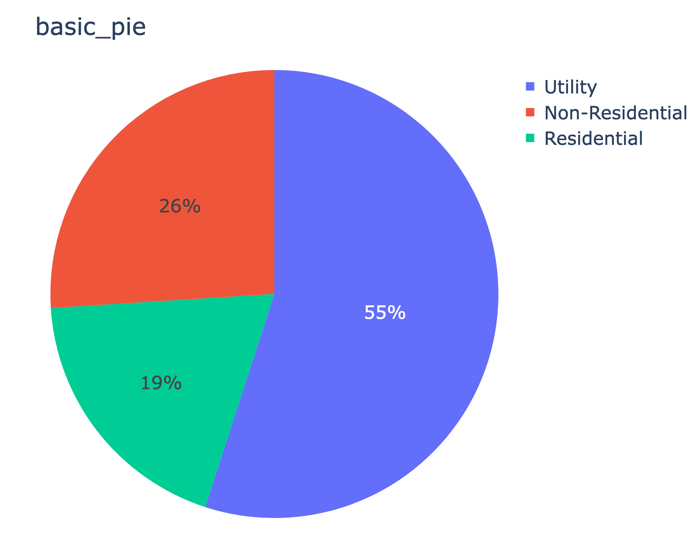
      </a>
      <br />
      <p style="margin-top: 8px;"><sub><b>basic_pie</b></sub></p>
    </td>
    <td align="center" width="20%" valign="top" style="padding: 10px;">
      <a href="https://jimmyorourke.github.io/plotlypp/examples/output/bubble_chart_sized_by_variable.html">
        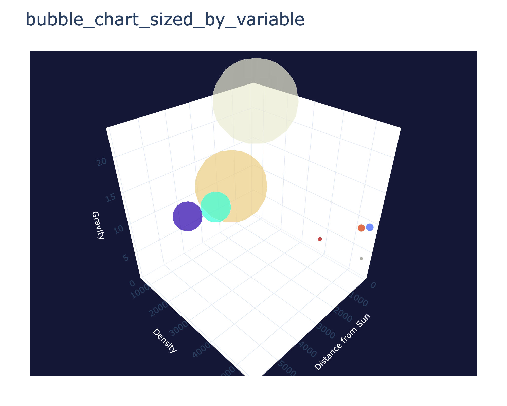
      </a>
      <br />
      <p style="margin-top: 8px;"><sub><b>bubble_chart_sized_by_variable</b></sub></p>
    </td>
    <td align="center" width="20%" valign="top" style="padding: 10px;">
      <a href="https://jimmyorourke.github.io/plotlypp/examples/output/bubble_with_marker_size_and_color.html">
        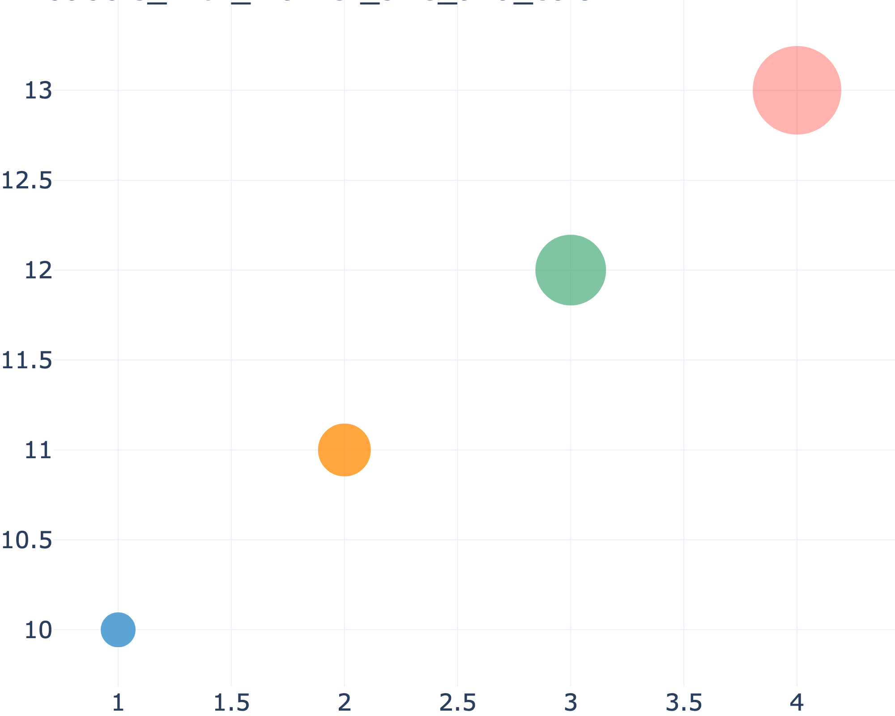
      </a>
      <br />
      <p style="margin-top: 8px;"><sub><b>bubble_with_marker_size_and_color</b></sub></p>
    </td>
    <td align="center" width="20%" valign="top" style="padding: 10px;">
      <a href="https://jimmyorourke.github.io/plotlypp/examples/output/carpet_with_scatter_trace.html">
        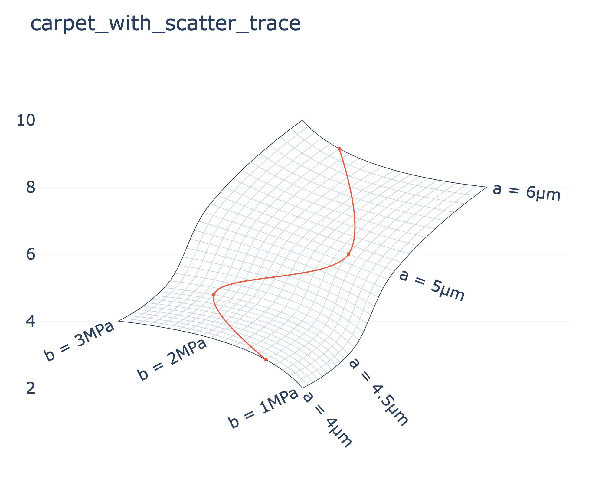
      </a>
      <br />
      <p style="margin-top: 8px;"><sub><b>carpet_with_scatter_trace</b></sub></p>
    </td>
    <td align="center" width="20%" valign="top" style="padding: 10px;">
      <a href="https://jimmyorourke.github.io/plotlypp/examples/output/categorical_dot_plot.html">
        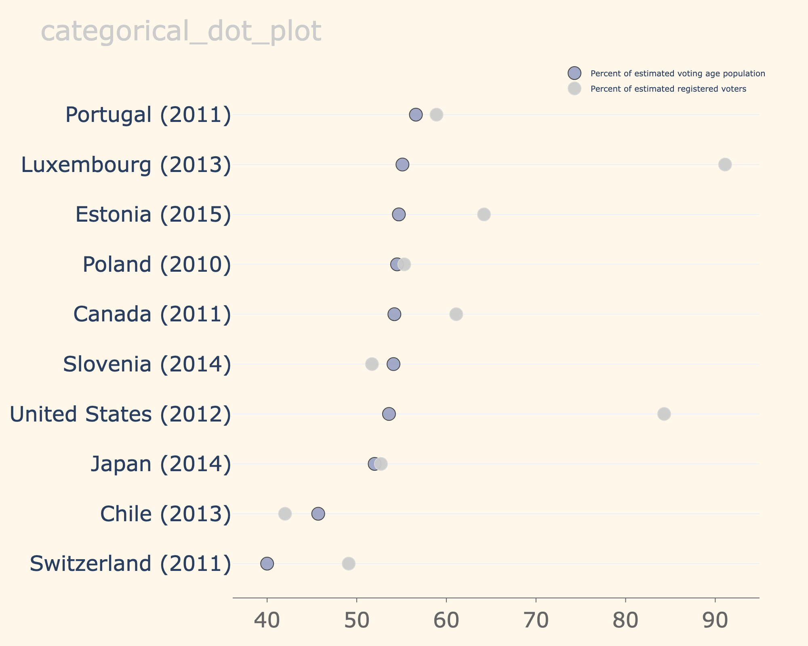
      </a>
      <br />
      <p style="margin-top: 8px;"><sub><b>categorical_dot_plot</b></sub></p>
    </td>
  </tr>
  <tr>
    <td align="center" width="20%" valign="top" style="padding: 10px;">
      <a href="https://jimmyorourke.github.io/plotlypp/examples/output/colored_and_styled_histograms.html">
        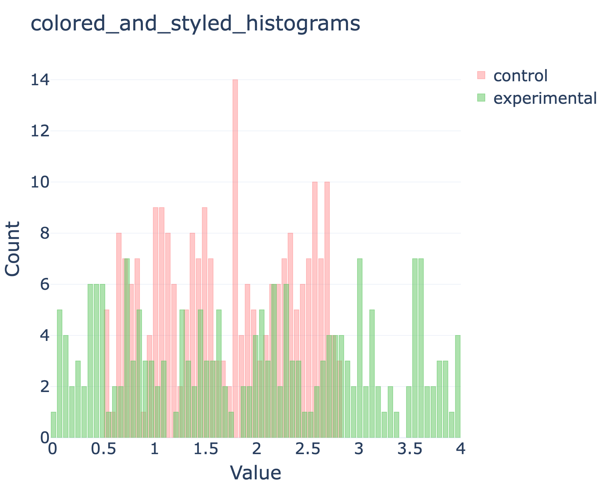
      </a>
      <br />
      <p style="margin-top: 8px;"><sub><b>colored_and_styled_histograms</b></sub></p>
    </td>
    <td align="center" width="20%" valign="top" style="padding: 10px;">
      <a href="https://jimmyorourke.github.io/plotlypp/examples/output/colored_box_plot.html">
        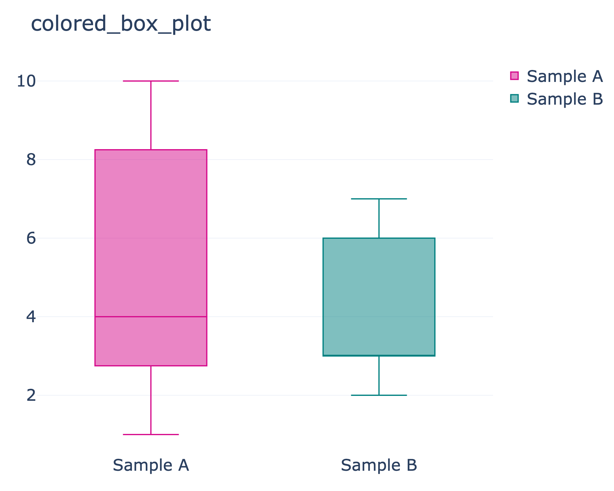
      </a>
      <br />
      <p style="margin-top: 8px;"><sub><b>colored_box_plot</b></sub></p>
    </td>
    <td align="center" width="20%" valign="top" style="padding: 10px;">
      <a href="https://jimmyorourke.github.io/plotlypp/examples/output/colorscale_for_contour_plot.html">
        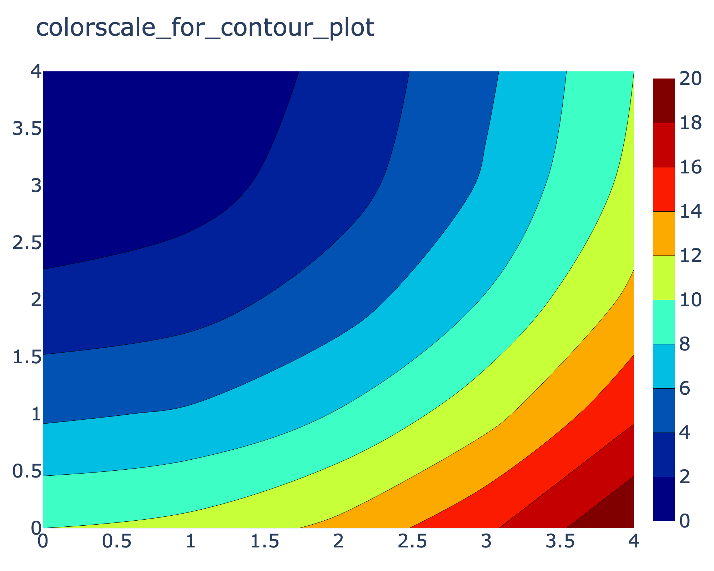
      </a>
      <br />
      <p style="margin-top: 8px;"><sub><b>colorscale_for_contour_plot</b></sub></p>
    </td>
    <td align="center" width="20%" valign="top" style="padding: 10px;">
      <a href="https://jimmyorourke.github.io/plotlypp/examples/output/continuous_filled_error_bars.html">
        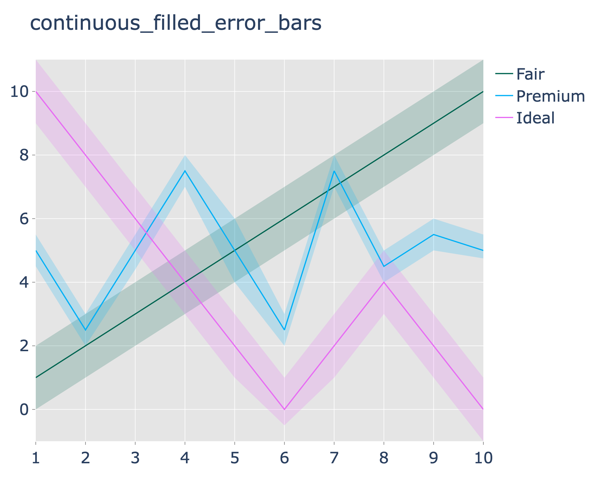
      </a>
      <br />
      <p style="margin-top: 8px;"><sub><b>continuous_filled_error_bars</b></sub></p>
    </td>
    <td align="center" width="20%" valign="top" style="padding: 10px;">
      <a href="https://jimmyorourke.github.io/plotlypp/examples/output/data_labels_on_plot.html">
        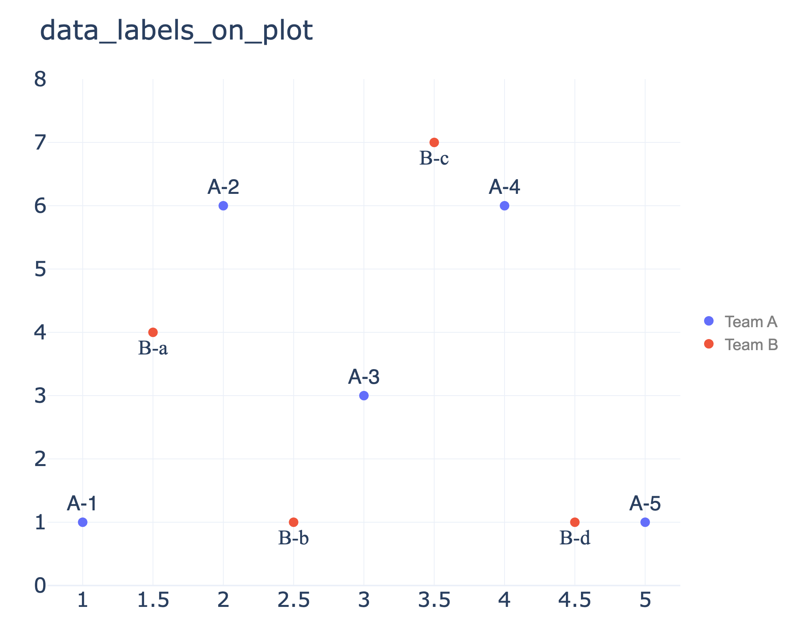
      </a>
      <br />
      <p style="margin-top: 8px;"><sub><b>data_labels_on_plot</b></sub></p>
    </td>
  </tr>
  <tr>
    <td align="center" width="20%" valign="top" style="padding: 10px;">
      <a href="https://jimmyorourke.github.io/plotlypp/examples/output/donut.html">
        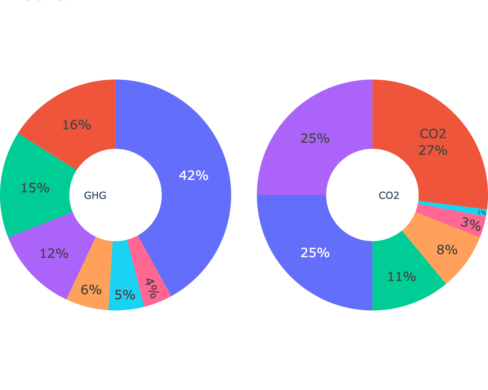
      </a>
      <br />
      <p style="margin-top: 8px;"><sub><b>donut</b></sub></p>
    </td>
    <td align="center" width="20%" valign="top" style="padding: 10px;">
      <a href="https://jimmyorourke.github.io/plotlypp/examples/output/gen2d_histogram_bivariate_normal.html">
        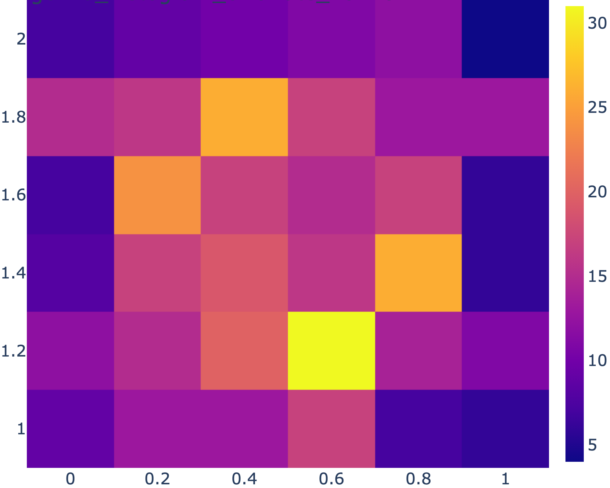
      </a>
      <br />
      <p style="margin-top: 8px;"><sub><b>gen2d_histogram_bivariate_normal</b></sub></p>
    </td>
    <td align="center" width="20%" valign="top" style="padding: 10px;">
      <a href="https://jimmyorourke.github.io/plotlypp/examples/output/gen2d_histogram_contour.html">
        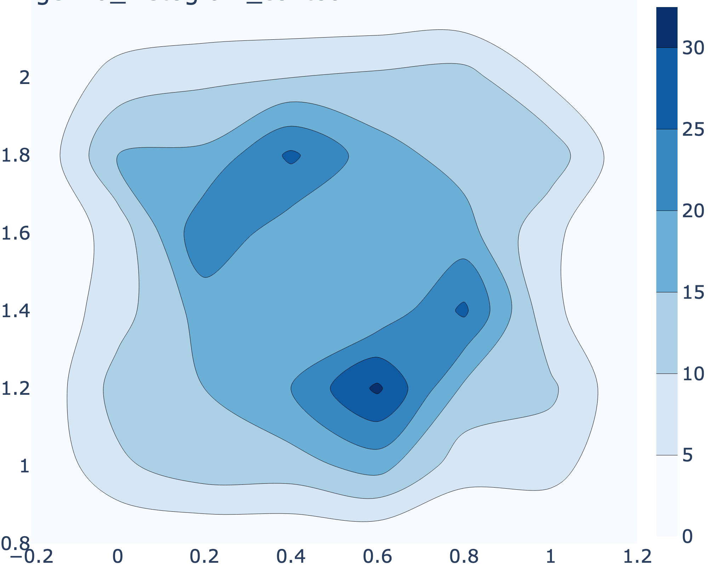
      </a>
      <br />
      <p style="margin-top: 8px;"><sub><b>gen2d_histogram_contour</b></sub></p>
    </td>
    <td align="center" width="20%" valign="top" style="padding: 10px;">
      <a href="https://jimmyorourke.github.io/plotlypp/examples/output/gen3d_line_spiral.html">
        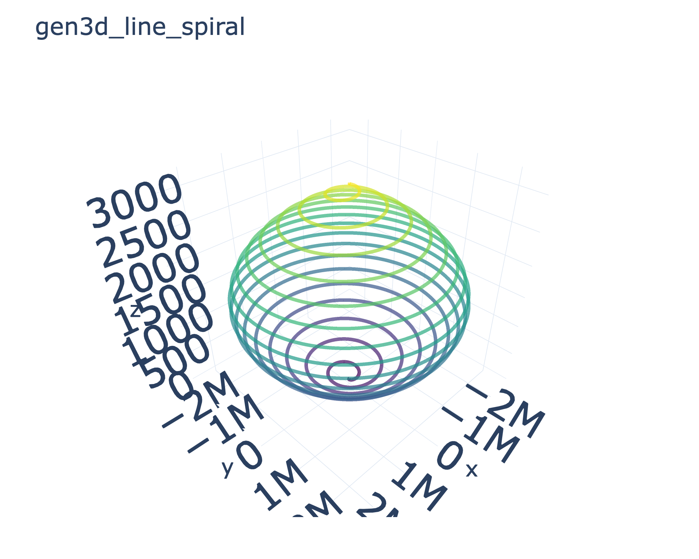
      </a>
      <br />
      <p style="margin-top: 8px;"><sub><b>gen3d_line_spiral</b></sub></p>
    </td>
    <td align="center" width="20%" valign="top" style="padding: 10px;">
      <a href="https://jimmyorourke.github.io/plotlypp/examples/output/gen3d_scatter_with_colorscaling_and_marker_styling.html">
        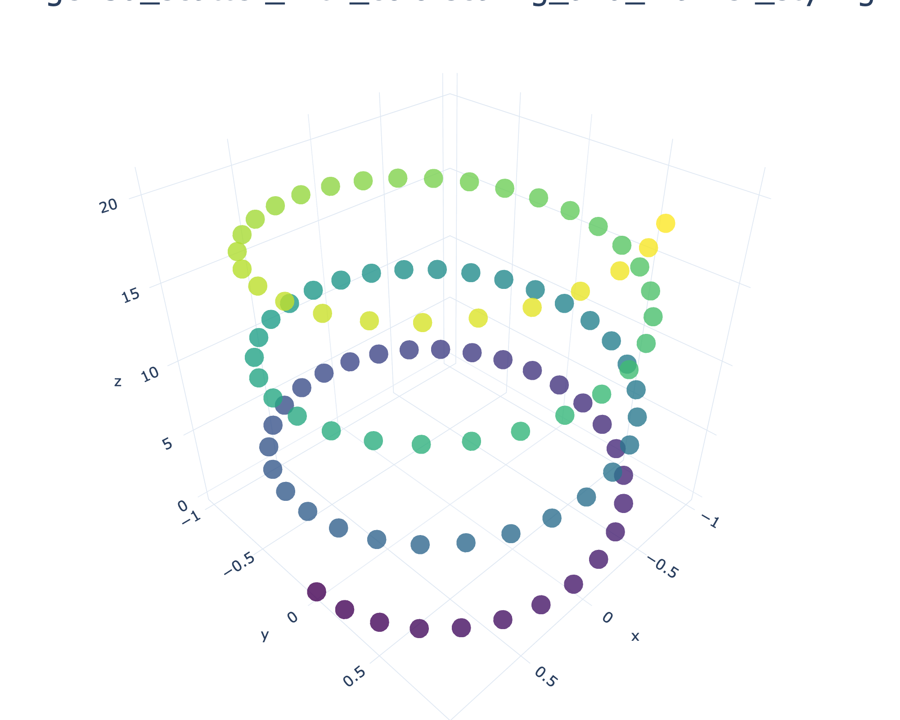
      </a>
      <br />
      <p style="margin-top: 8px;"><sub><b>gen3d_scatter_with_colorscaling_and_marker_styling</b></sub></p>
    </td>
  </tr>
  <tr>
    <td align="center" width="20%" valign="top" style="padding: 10px;">
      <a href="https://jimmyorourke.github.io/plotlypp/examples/output/gen3d_subplots.html">
        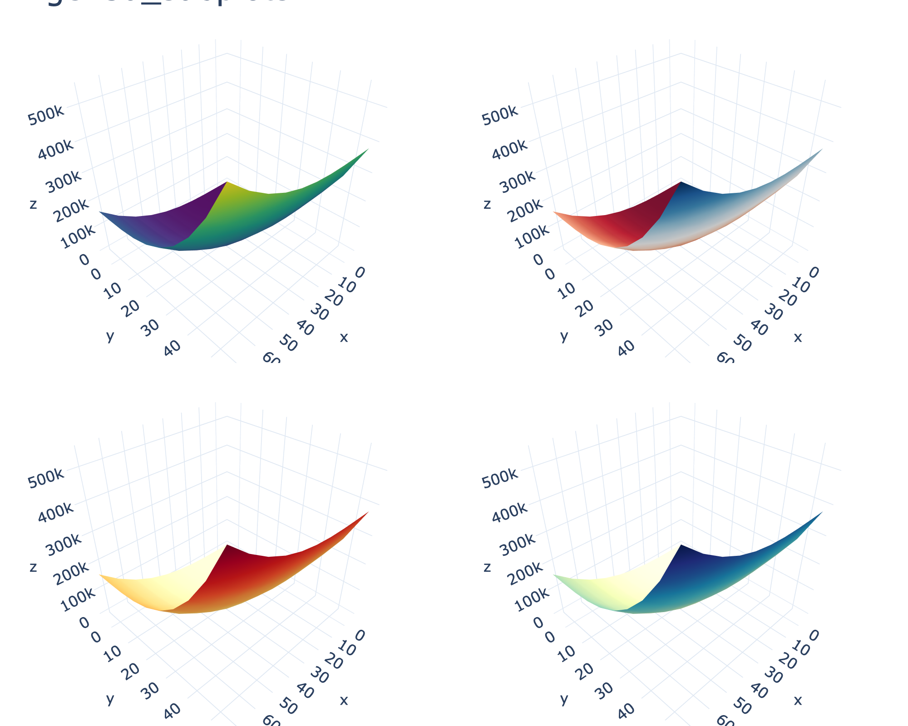
      </a>
      <br />
      <p style="margin-top: 8px;"><sub><b>gen3d_subplots</b></sub></p>
    </td>
    <td align="center" width="20%" valign="top" style="padding: 10px;">
      <a href="https://jimmyorourke.github.io/plotlypp/examples/output/gen3d_surface_contours.html">
        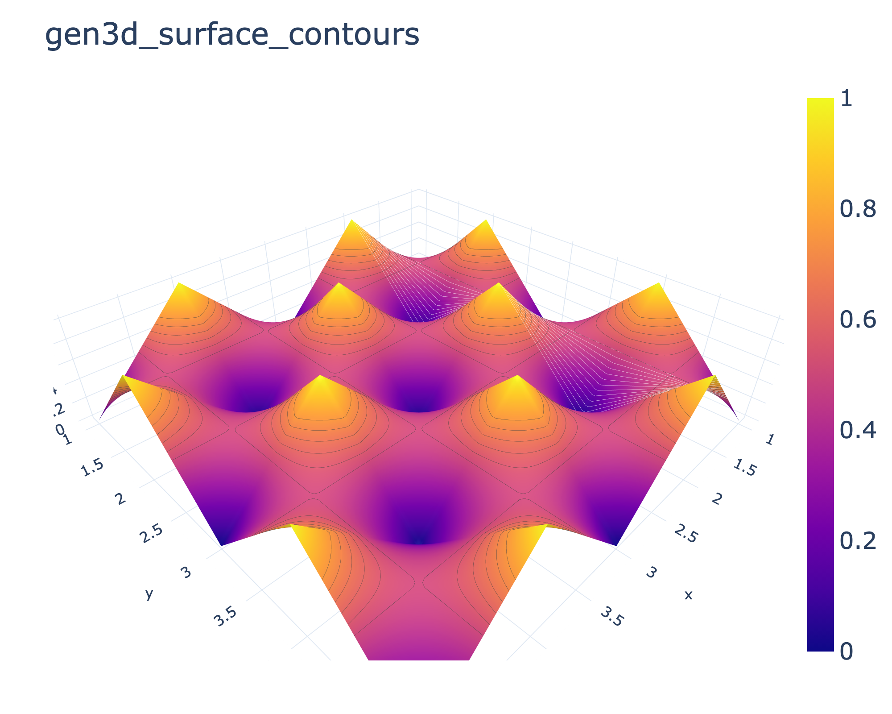
      </a>
      <br />
      <p style="margin-top: 8px;"><sub><b>gen3d_surface_contours</b></sub></p>
    </td>
    <td align="center" width="20%" valign="top" style="padding: 10px;">
      <a href="https://jimmyorourke.github.io/plotlypp/examples/output/gen3d_surface_torus.html">
        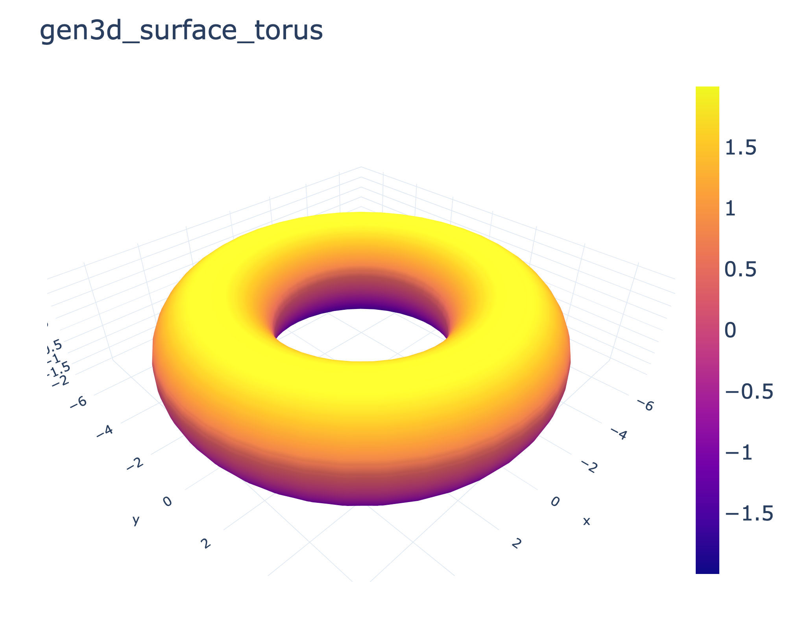
      </a>
      <br />
      <p style="margin-top: 8px;"><sub><b>gen3d_surface_torus</b></sub></p>
    </td>
    <td align="center" width="20%" valign="top" style="padding: 10px;">
      <a href="https://jimmyorourke.github.io/plotlypp/examples/output/grouped_bar.html">
        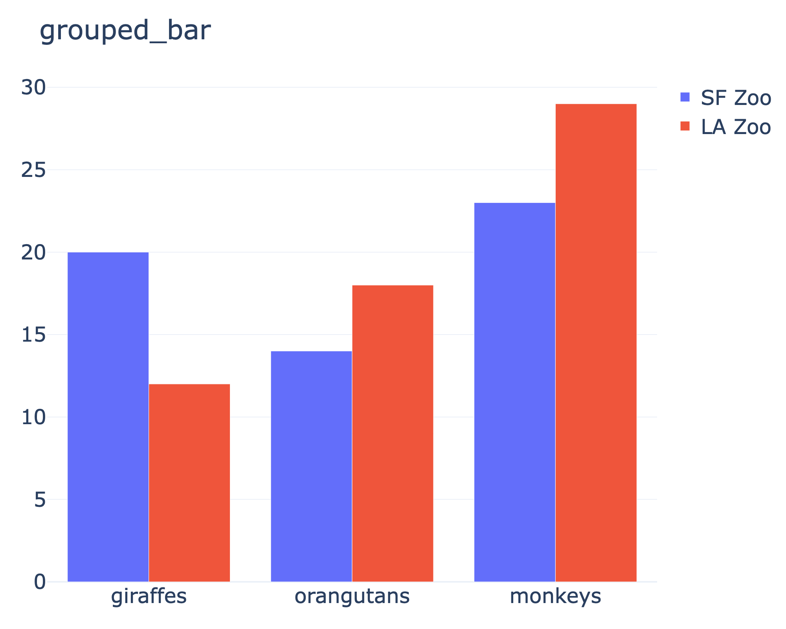
      </a>
      <br />
      <p style="margin-top: 8px;"><sub><b>grouped_bar</b></sub></p>
    </td>
    <td align="center" width="20%" valign="top" style="padding: 10px;">
      <a href="https://jimmyorourke.github.io/plotlypp/examples/output/grouped_scatter.html">
        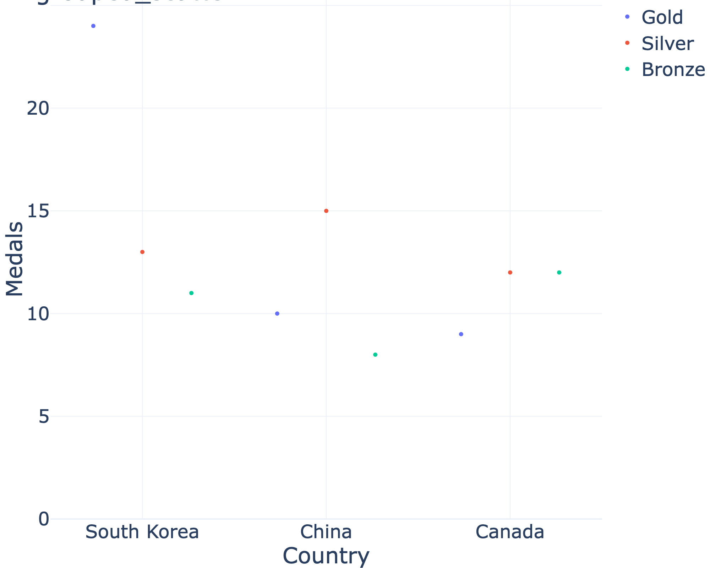
      </a>
      <br />
      <p style="margin-top: 8px;"><sub><b>grouped_scatter</b></sub></p>
    </td>
  </tr>
  <tr>
    <td align="center" width="20%" valign="top" style="padding: 10px;">
      <a href="https://jimmyorourke.github.io/plotlypp/examples/output/horizontal_bar.html">
        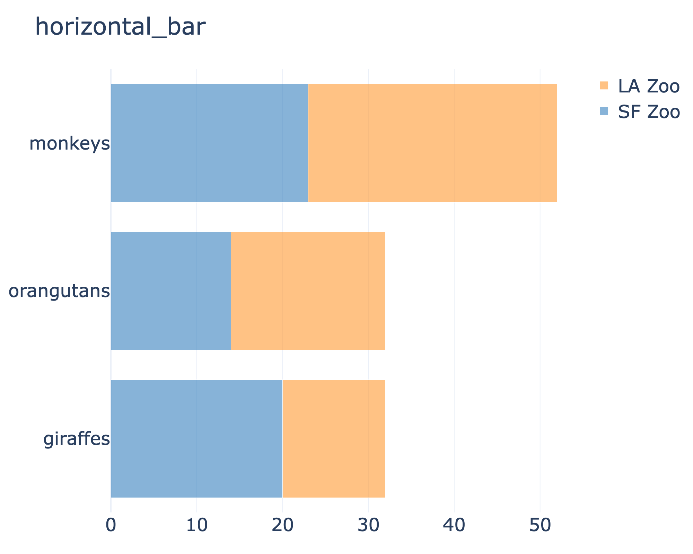
      </a>
      <br />
      <p style="margin-top: 8px;"><sub><b>horizontal_bar</b></sub></p>
    </td>
    <td align="center" width="20%" valign="top" style="padding: 10px;">
      <a href="https://jimmyorourke.github.io/plotlypp/examples/output/indicator.html">
        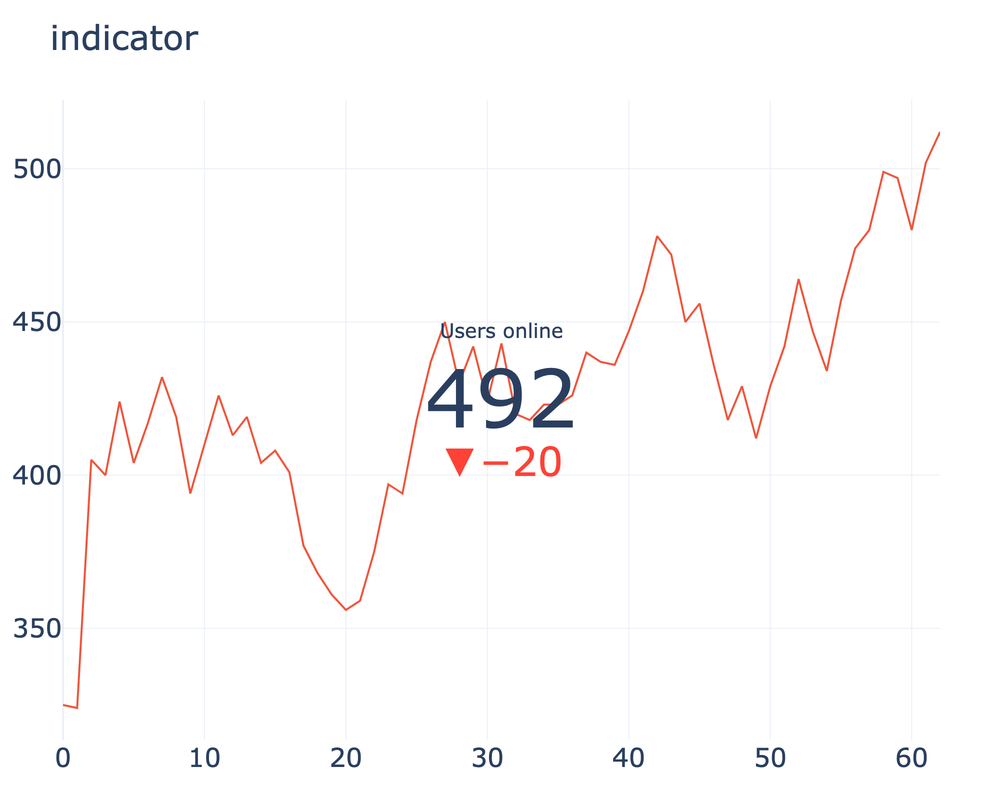
      </a>
      <br />
      <p style="margin-top: 8px;"><sub><b>indicator</b></sub></p>
    </td>
    <td align="center" width="20%" valign="top" style="padding: 10px;">
      <a href="https://jimmyorourke.github.io/plotlypp/examples/output/inset_graph.html">
        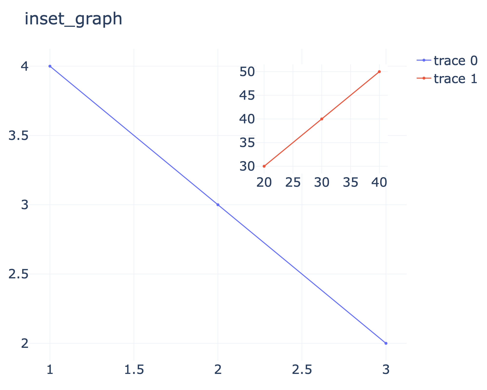
      </a>
      <br />
      <p style="margin-top: 8px;"><sub><b>inset_graph</b></sub></p>
    </td>
    <td align="center" width="20%" valign="top" style="padding: 10px;">
      <a href="https://jimmyorourke.github.io/plotlypp/examples/output/light_tile.html">
        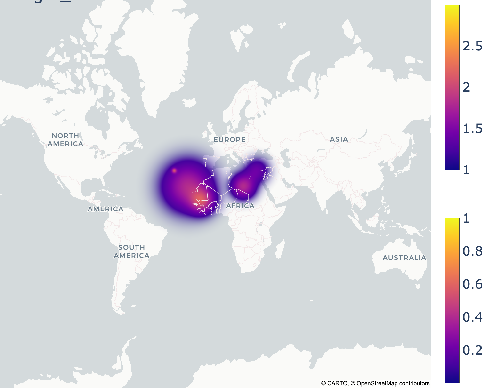
      </a>
      <br />
      <p style="margin-top: 8px;"><sub><b>light_tile</b></sub></p>
    </td>
    <td align="center" width="20%" valign="top" style="padding: 10px;">
      <a href="https://jimmyorourke.github.io/plotlypp/examples/output/line_and_scatter_with_names_axes_title.html">
        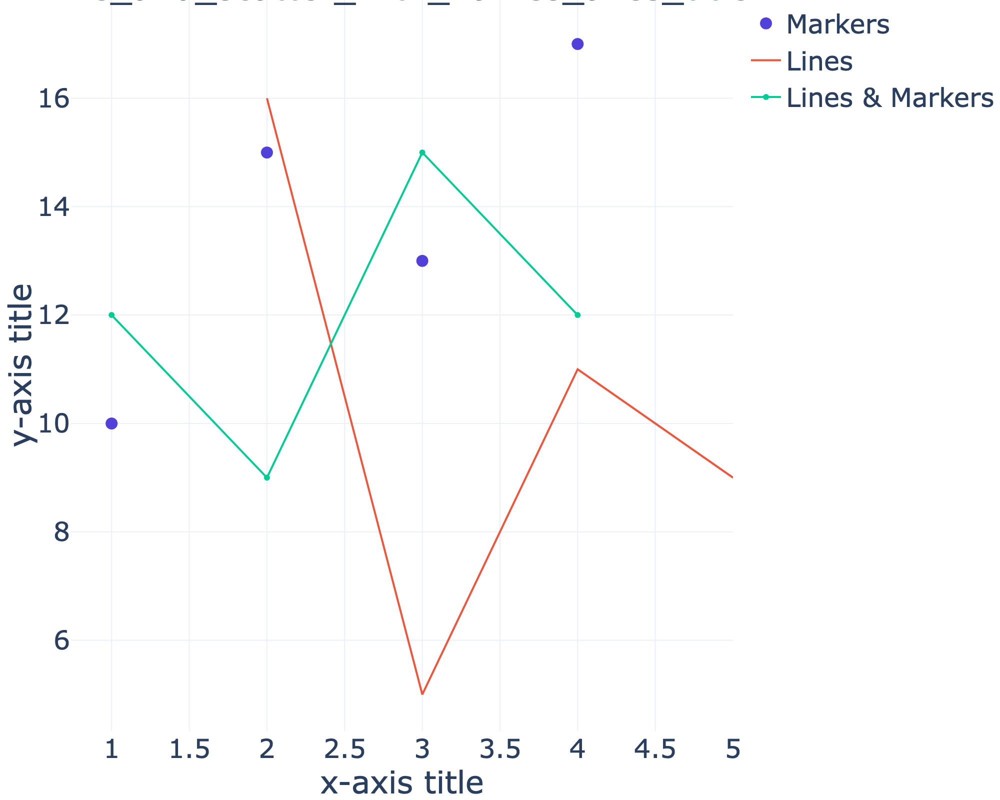
      </a>
      <br />
      <p style="margin-top: 8px;"><sub><b>line_and_scatter_with_names_axes_title</b></sub></p>
    </td>
  </tr>
  <tr>
    <td align="center" width="20%" valign="top" style="padding: 10px;">
      <a href="https://jimmyorourke.github.io/plotlypp/examples/output/line_dashes.html">
        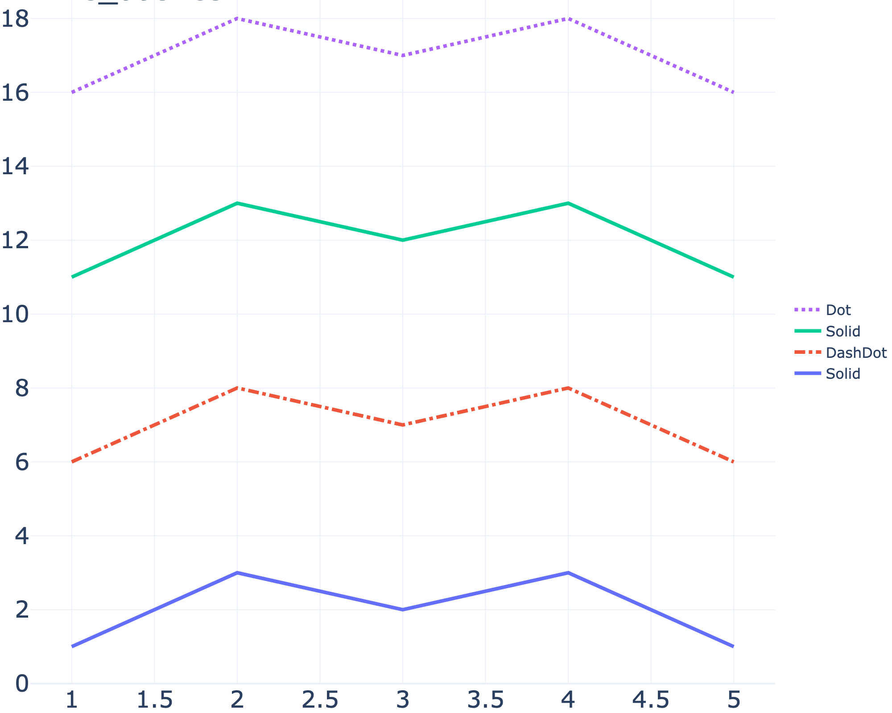
      </a>
      <br />
      <p style="margin-top: 8px;"><sub><b>line_dashes</b></sub></p>
    </td>
    <td align="center" width="20%" valign="top" style="padding: 10px;">
      <a href="https://jimmyorourke.github.io/plotlypp/examples/output/lines_on_maps.html">
        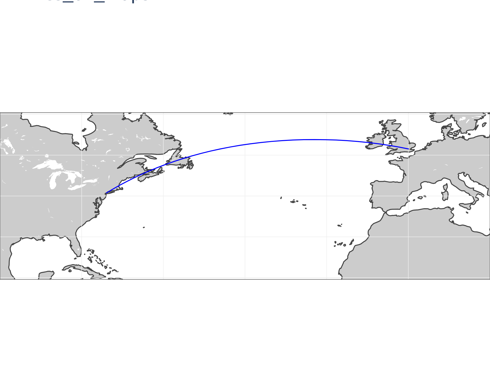
      </a>
      <br />
      <p style="margin-top: 8px;"><sub><b>lines_on_maps</b></sub></p>
    </td>
    <td align="center" width="20%" valign="top" style="padding: 10px;">
      <a href="https://jimmyorourke.github.io/plotlypp/examples/output/mesh_cube.html">
        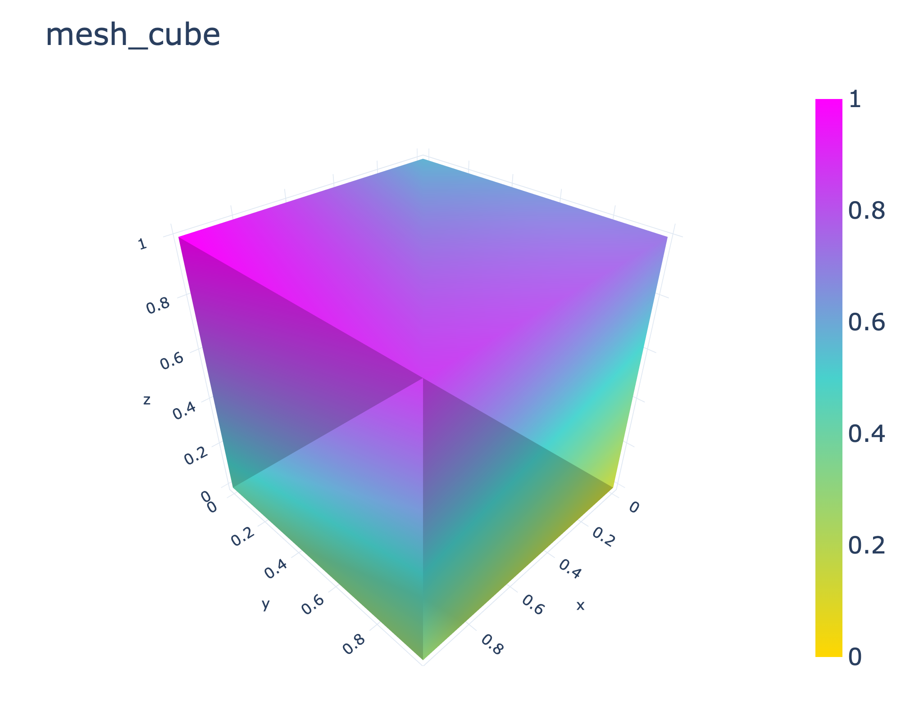
      </a>
      <br />
      <p style="margin-top: 8px;"><sub><b>mesh_cube</b></sub></p>
    </td>
    <td align="center" width="20%" valign="top" style="padding: 10px;">
      <a href="https://jimmyorourke.github.io/plotlypp/examples/output/mixed_subplots.html">
        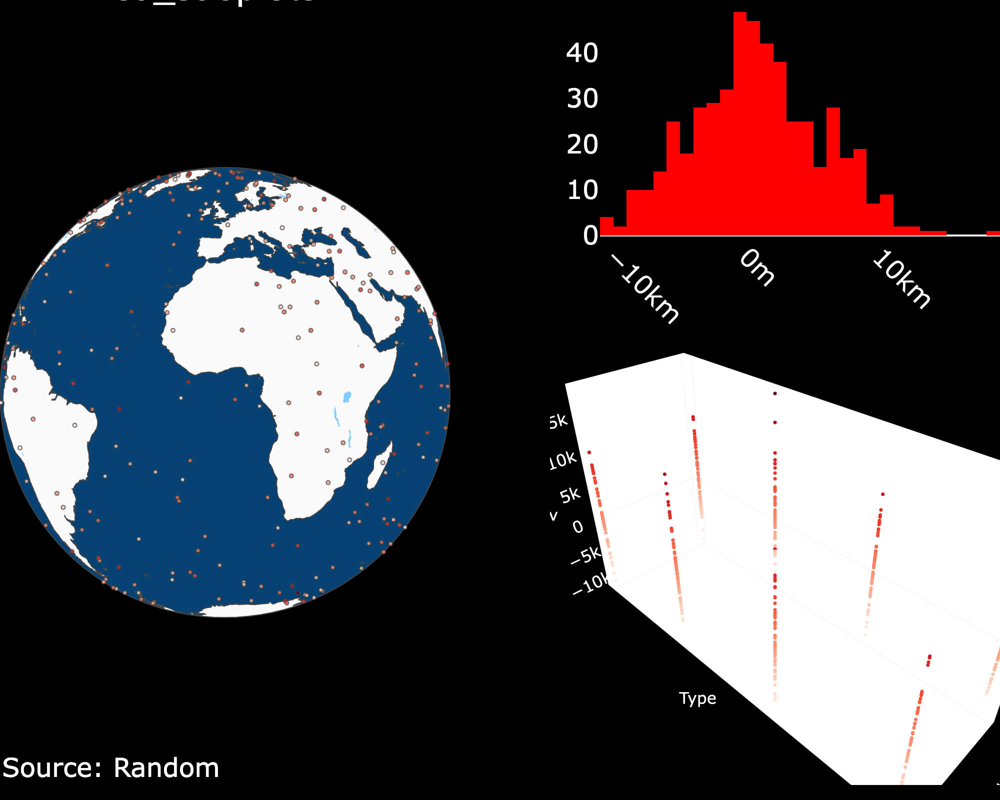
      </a>
      <br />
      <p style="margin-top: 8px;"><sub><b>mixed_subplots</b></sub></p>
    </td>
    <td align="center" width="20%" valign="top" style="padding: 10px;">
      <a href="https://jimmyorourke.github.io/plotlypp/examples/output/multiple_3d_isosurfaces.html">
        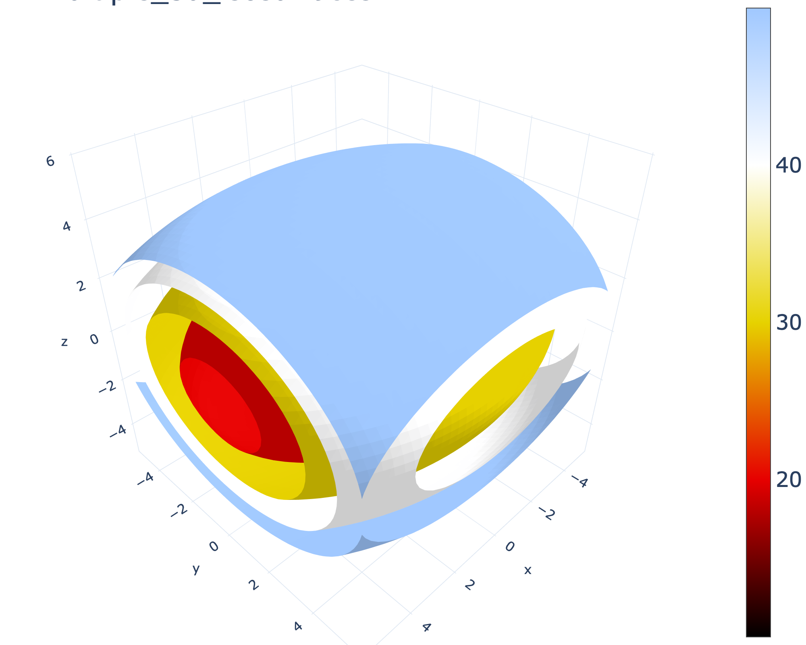
      </a>
      <br />
      <p style="margin-top: 8px;"><sub><b>multiple_3d_isosurfaces</b></sub></p>
    </td>
  </tr>
  <tr>
    <td align="center" width="20%" valign="top" style="padding: 10px;">
      <a href="https://jimmyorourke.github.io/plotlypp/examples/output/multiple_3d_surface_plots.html">
        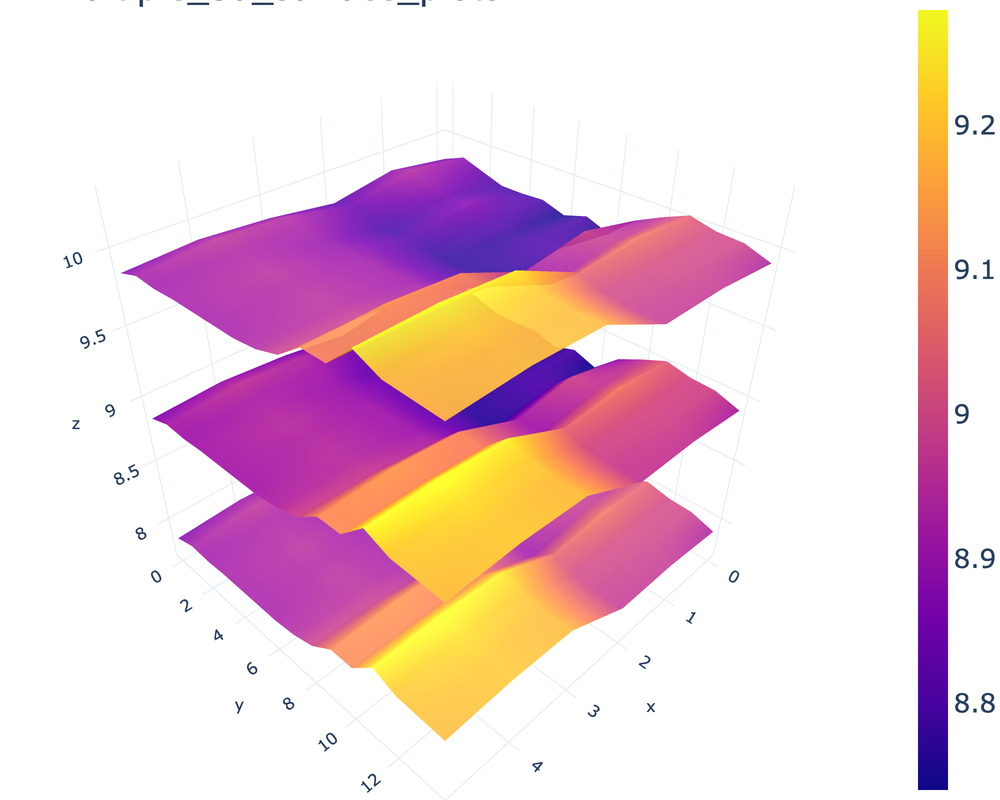
      </a>
      <br />
      <p style="margin-top: 8px;"><sub><b>multiple_3d_surface_plots</b></sub></p>
    </td>
    <td align="center" width="20%" valign="top" style="padding: 10px;">
      <a href="https://jimmyorourke.github.io/plotlypp/examples/output/multiple_subplots_with_shared_axes.html">
        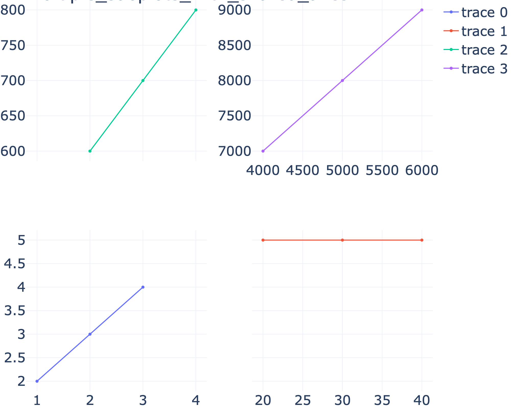
      </a>
      <br />
      <p style="margin-top: 8px;"><sub><b>multiple_subplots_with_shared_axes</b></sub></p>
    </td>
    <td align="center" width="20%" valign="top" style="padding: 10px;">
      <a href="https://jimmyorourke.github.io/plotlypp/examples/output/multiple_trace_radar_chart.html">
        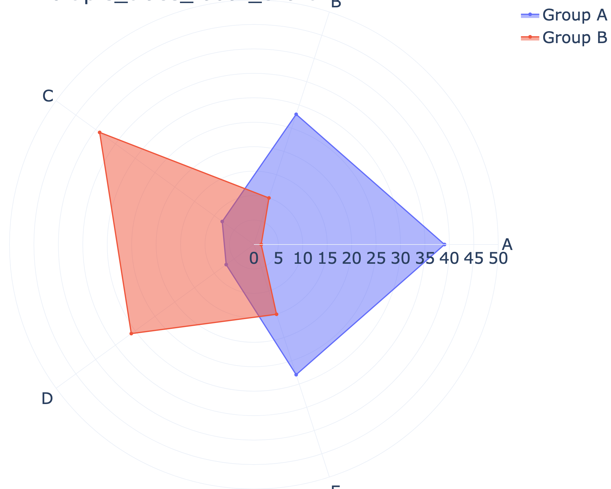
      </a>
      <br />
      <p style="margin-top: 8px;"><sub><b>multiple_trace_radar_chart</b></sub></p>
    </td>
    <td align="center" width="20%" valign="top" style="padding: 10px;">
      <a href="https://jimmyorourke.github.io/plotlypp/examples/output/outline_map_locations.html">
        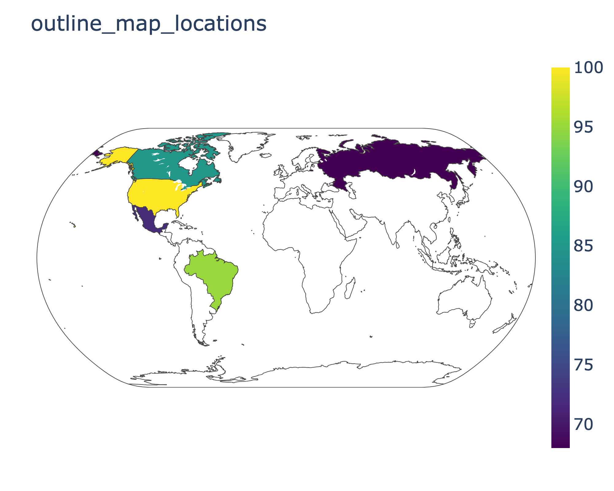
      </a>
      <br />
      <p style="margin-top: 8px;"><sub><b>outline_map_locations</b></sub></p>
    </td>
    <td align="center" width="20%" valign="top" style="padding: 10px;">
      <a href="https://jimmyorourke.github.io/plotlypp/examples/output/scatter_tile_maps.html">
        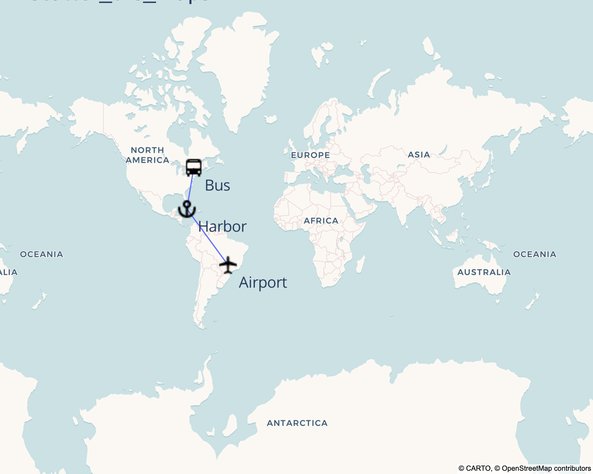
      </a>
      <br />
      <p style="margin-top: 8px;"><sub><b>scatter_tile_maps</b></sub></p>
    </td>
  </tr>
  <tr>
    <td align="center" width="20%" valign="top" style="padding: 10px;">
      <a href="https://jimmyorourke.github.io/plotlypp/examples/output/scatter_with_color_dimension.html">
        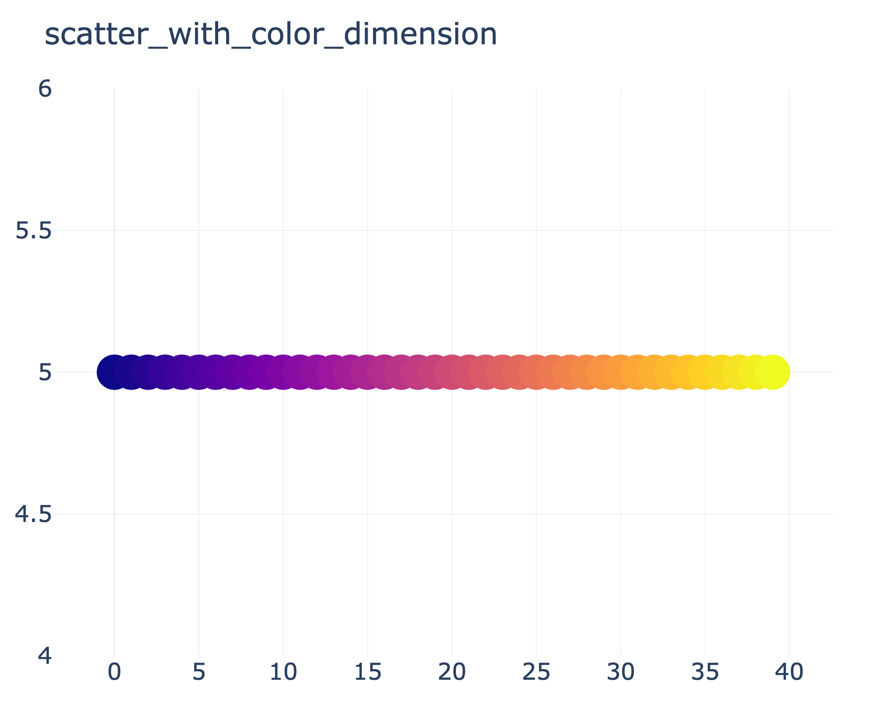
      </a>
      <br />
      <p style="margin-top: 8px;"><sub><b>scatter_with_color_dimension</b></sub></p>
    </td>
    <td align="center" width="20%" valign="top" style="padding: 10px;">
      <a href="https://jimmyorourke.github.io/plotlypp/examples/output/simple_volume_plot.html">
        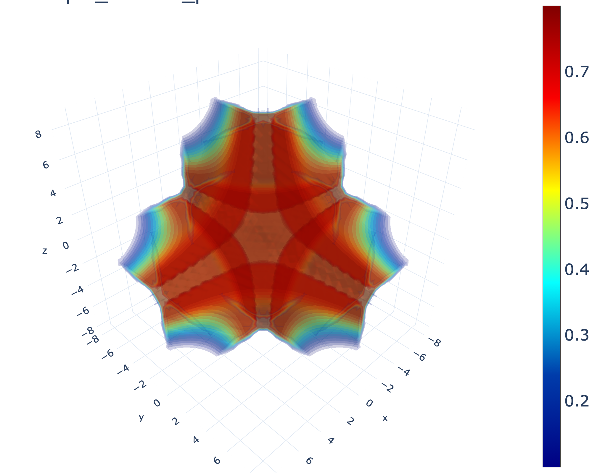
      </a>
      <br />
      <p style="margin-top: 8px;"><sub><b>simple_volume_plot</b></sub></p>
    </td>
    <td align="center" width="20%" valign="top" style="padding: 10px;">
      <a href="https://jimmyorourke.github.io/plotlypp/examples/output/smith_chart_subplots_with_stlying.html">
        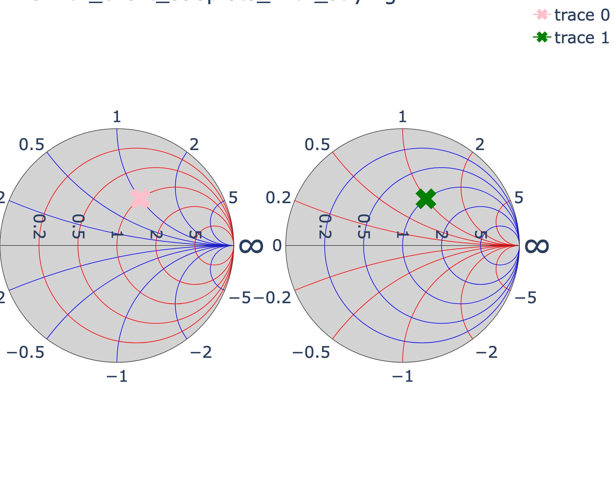
      </a>
      <br />
      <p style="margin-top: 8px;"><sub><b>smith_chart_subplots_with_stlying</b></sub></p>
    </td>
    <td align="center" width="20%" valign="top" style="padding: 10px;">
      <a href="https://jimmyorourke.github.io/plotlypp/examples/output/subplots_domain_layout.html">
        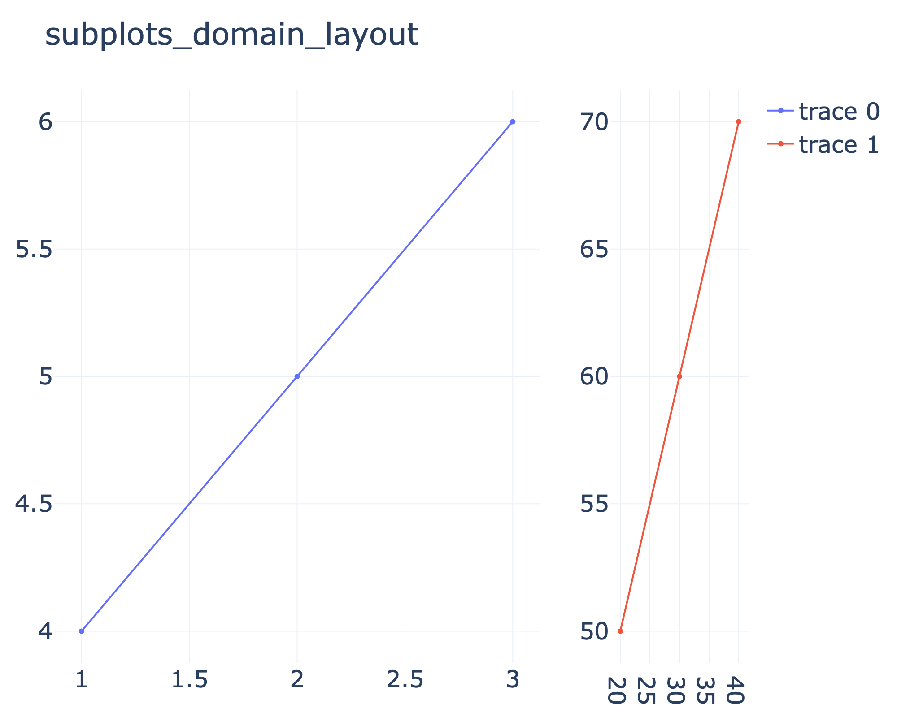
      </a>
      <br />
      <p style="margin-top: 8px;"><sub><b>subplots_domain_layout</b></sub></p>
    </td>
    <td align="center" width="20%" valign="top" style="padding: 10px;">
      <a href="https://jimmyorourke.github.io/plotlypp/examples/output/subplots_grid_layout.html">
        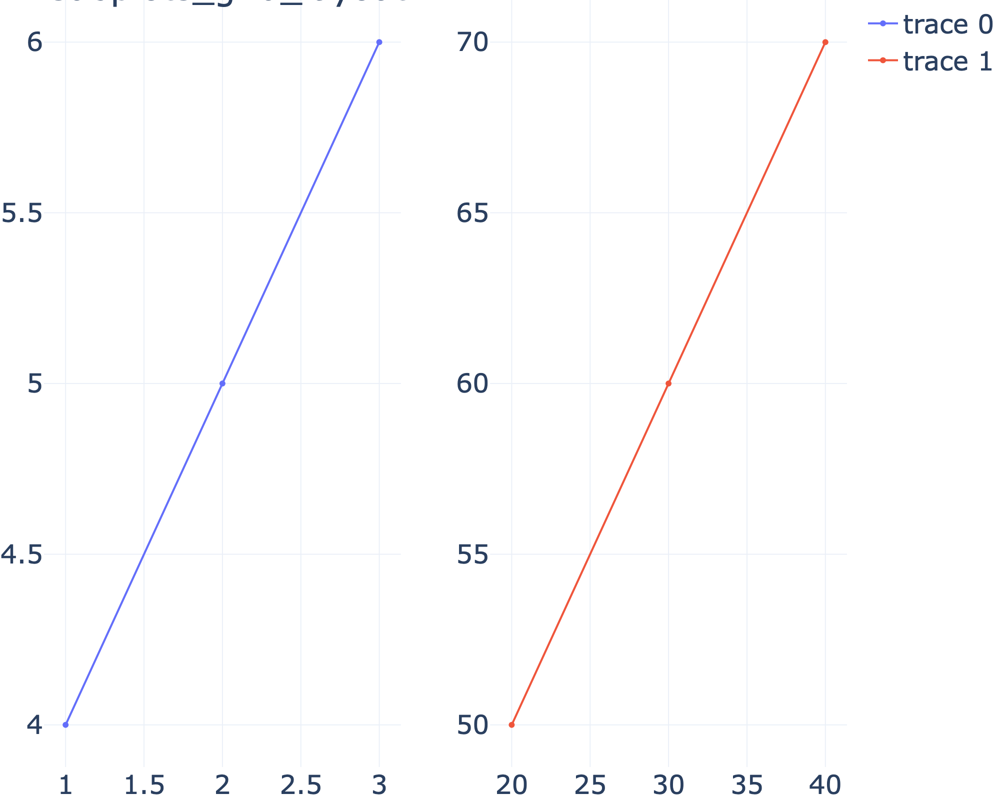
      </a>
      <br />
      <p style="margin-top: 8px;"><sub><b>subplots_grid_layout</b></sub></p>
    </td>
  </tr>
</table>


TODO

### Building and running the examples

```
cmake -S . -B build -G <your favourite generator>
cmake --build build
./build/examples/example
```

When included as part of a larger CMake project, the example target will not be built, unless `PLOTLYPP_BUILD_EXAMPLES` is set.

## Additional Documentation

Since much of Plotly++ is auto-generated from Plotly.js sources, the official [Plotly.js documentation](https://plotly.com/javascript/) is the best source for additional documentation about trace and chart types and parameters and layout options.

## Dependencies

* C++17 or newer
* [nlohmann JSON](https://github.com/nlohmann/json)

The CMakeLists will attempt to use `find_package` to find `nlohmann_json` when Plotly++ is built as part of a larger project. When Plotly++ is the main project (eg for just building the examples), CMake will use `FetchContent` to download `nlohmann_json` to a project-local directory.

While not directly supported at present, nlohmann JSON could be swapped out for another JSON library will minimal work. Libraries with similar APIs such as Boost JSON could easily be swapped in by updating the alias type in [json.hpp](include/plotlypp/json.hpp). For less similar libraries a stronger abstraction would be required.

When compiling with C++17, trace data for plots is required to be `std::vector`. When using C++20 or newer, `std::span` automatically becomes supported.

If regenerating Plotly++ headers, Python3.6+ is required.

## Offline Rendering

The HTML emitted by Plotly++ requires the Plotly.js Javascript library in order to render in a web browser. Plotly++ prefers offline rendering when possible, so the HTML output instructs the web browser to first try to load Plotly.js from a local file in a `js` subdirectory of the HTML file's directory. Plotly++ emits the required file as `js/plotly.min.js` when `Figure.writeHtmlFigure()` is called with parameter `includeJsResources` set to true (the default). If the local Plotly.js file is not found, the Plotly++ HTML will try to acquire and use Plotly.js from the official CDN, requiring an internet connection unless your browser already has it cached.
